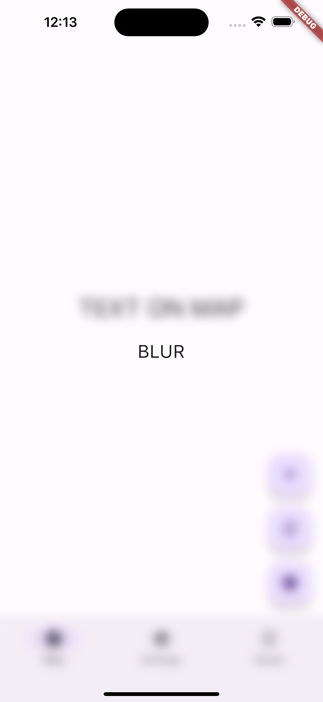

# Flutter 3.7 BackdropFilter issue

Comparing two versions: 3.3.10 and 3.7.7.

For quick switching between two versions, use fvm.

# Comparising

**iOS version:** 16.2 (simulator)

| Flutter 3.3.10  | Flutter 3.7.7 | Flutter 3.22 | Comment |
| ------------- | ------------- | ------------- | ------------- |
|  |  |  | The word 'blur' applies a blur effect to the entire screen, which is the expected behavior. The word 'blur' is clearly visible, while the entire screen appears blurred. |
|   |   |   | Opening a regular modal with a blur overlay on top of a PlatformView. Version 3.3 does not show any blur at all, while version 3.7 displays a sharp blur without border radius.  |
|   |  |   | Displaying a blur overlay on top of a PlatformView. In version 3.3, everything is blurred except for Flutter widgets. There are also issues with the widget that is on top of the PlatformView. In version 3.7, the PlatformView is blurred, but the bottom navigation bar and FAB buttons are not blurred (although their icons are blurred).  |
|   |   |   | An animated square with a blur effect. In version 3.3, the square is only visible when it is far behind the PlatformView. In version 3.7, the square is always visible, but it does not blur the widget when it is on top of the PlatformView, and it removes the border radius when it lands on the PlatformView.  |

# The main issues are: 

1. Sudden appearance of blur during animation (noticeable when opening a Cupertino alert).

2. Absence of border radius on PlatformView.

3. Absence of blur on widgets when they are on top of PlatformView.

# When does this issue matter?

1. This issue matters when you are trying to display an alert on top of a PlatformView.

2. This issue matters when you have a PlatformView (e.g. a map) being used at the center of the screen.
